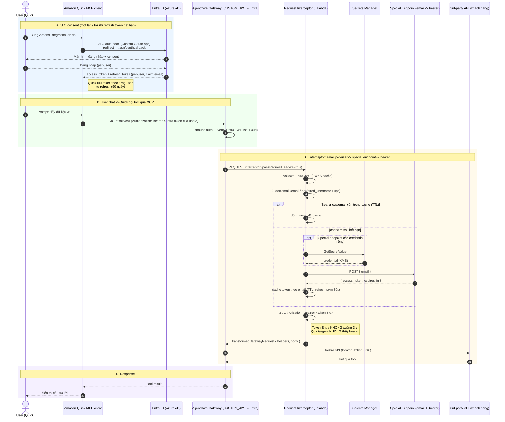

# Sequence — Amazon Quick (3LO Entra ID) → AgentCore Gateway → interceptor (email→bearer) → 3rd-party API

**Client = Amazon Quick** (MCP Actions connector), KHÔNG phải app React tự viết.
Quick tự lo OAuth 3LO với Entra ID; nó mang Entra token (per-user) tới Gateway.
Gateway authorizer = CUSTOM_JWT (issuer = Entra). Request Lambda Interceptor đọc
email từ Entra JWT, đổi lấy bearer per-user ở special endpoint, inject xuống 3rd API.

## Vì sao PHẢI 3LO (không phải 2LO)

- Bạn cần **email của user đang chat** để đổi lấy bearer riêng của họ.
- **2LO (service-to-service / client-credentials)** chạy dưới một service account
  dùng chung → token KHÔNG mang identity của user → interceptor không biết email ai.
- **3LO** mỗi user tự đăng nhập Entra một lần → token mang claim email per-user →
  interceptor đổi đúng bearer cho từng người. Đó là lý do khối A có bước consent.

## Cấu hình mấu chốt trên Amazon Quick (Custom OAuth app = Entra)

Trong Quick, tạo MCP (hoặc REST) Actions integration, chọn **Custom OAuth app** (3LO):

| Field Quick | Giá trị (từ Entra App Registration) |
|---|---|
| Client ID / Client Secret | App registration của bạn trên Entra |
| Authorization URL | `https://login.microsoftonline.com/{tenant}/oauth2/v2.0/authorize` |
| Token URL | `https://login.microsoftonline.com/{tenant}/oauth2/v2.0/token` |
| Redirect URL | `https://{region}.quicksight.aws.amazon.com/sn/oauthcallback` |
| Scope | `openid email profile` + scope API của Gateway (expose 1 API scope) |
| MCP server endpoint | Gateway resource URL (`GatewayMcpUrl`) |

Entra App Registration phải:
- Thêm redirect URI `.../sn/oauthcallback`.
- Expose một API scope (Application ID URI) để Quick xin được access_token có `aud` khớp.
- Cấu hình optional claim **email** (hoặc dựa `preferred_username`/`upn`).

## Cấu hình mấu chốt trên AgentCore Gateway (inbound = Entra, KHÔNG phải Cognito)

- Authorizer = **CUSTOM_JWT**:
  - `discoveryUrl` = `https://login.microsoftonline.com/{tenant}/v2.0/.well-known/openid-configuration`
  - `allowedAudience` = Application ID URI của Entra app (khớp `aud` token Quick xin)
  - `allowedClients` (nếu cần) = client id của Entra app
- Interceptor REQUEST + `passRequestHeaders=true` → mới nhận được `Authorization`.
- Target: 3rd-party API (OpenAPI) hoặc MCP, **không gắn credential** — interceptor lo.

## Khác biệt so với sơ đồ trước (App React)

| | Trước (App React tự viết) | Giờ (Amazon Quick) |
|---|---|---|
| Ai login Entra | App React (auth-code + PKCE) | **Quick làm 3LO** (Custom OAuth app) |
| Ai gọi Runtime/Gateway | Runtime (Claude Agent SDK) qua proxy | **Quick MCP client** gọi thẳng Gateway |
| Redirect URI | của app bạn | `.../sn/oauthcallback` (cố định của Quick) |
| Token lifecycle | app tự quản | **Quick quản + refresh 90 ngày** |
| Phần interceptor | giữ nguyên | **giữ nguyên** (vẫn đọc email → bearer) |
