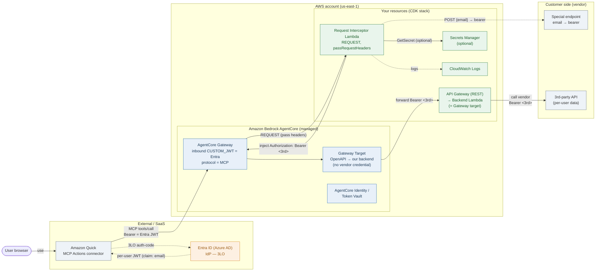

# Deployment topology — quick-entra-bearer-mcp

Component view of the deployed resources and the trust boundaries. Pairs with the
message-level [`sequence.md`](sequence.md): the sequence shows the ordered calls,
this shows *what runs where* and *who owns each boundary*.

## Boundaries

- **External actors / SaaS**: the user's browser and **Amazon Quick** (the MCP
  client), plus **Entra ID** as the identity provider. None of these is in your AWS
  account.
- **AWS account (us-east-1)**: everything this CDK stack deploys, in two trust zones.
  - **Amazon Bedrock AgentCore (managed)**: the Gateway, its Target, and AgentCore
    Identity / Token Vault. AWS runs these; you configure them.
  - **Your resources (CDK stack)**: the interceptor Lambda, the **custom backend
    (API Gateway + backend Lambda) that IS the Gateway target**, the optional Secrets
    Manager secret, and CloudWatch Logs. These are what `infra/stack.py` creates.
- **Customer side (vendor)**: the **special endpoint** (`email → bearer`) and the
  real **3rd-party API**. Outside your account, reached over the public internet. In
  the demo the backend calls a demo vendor Lambda instead (set `THIRD_PARTY_BASE_URL`).

## Flows (match the diagram arrows)

1. **User → Quick** — the user drives Amazon Quick.
2. **Quick ↔ Entra ID (3LO)** — Quick runs the OAuth authorization-code flow with
   Entra; the user signs in once and Quick stores a **per-user** token (claim: email),
   refreshing it (90-day refresh token).
3. **Quick → Gateway** — Quick's MCP client calls `tools/call` with the per-user
   Entra JWT in the Authorization header. Gateway inbound authorizer `CUSTOM_JWT`
   verifies issuer + audience against the Entra tenant.
4. **Gateway → Interceptor (REQUEST, passRequestHeaders)** — on every tool call the
   Gateway invokes the interceptor Lambda, forwarding request headers.
5. **Interceptor → Secrets Manager** *(optional)* — read a credential the special
   endpoint itself requires.
6. **Interceptor → Special endpoint** — `POST { email }` → `{ access_token }`,
   cached per email (TTL) so it is not minted on every call.
7. **Interceptor → Gateway (inject)** — returns the transformed request with
   `Authorization: Bearer <downstream>`; AWS forwards that header to the target.
8. **Gateway → Target → API Gateway → Backend Lambda** — the backend receives the
   request already carrying the per-user bearer.
9. **Backend → 3rd-party API** — the backend calls the real vendor with that bearer
   and shapes the response for the agent.
10. **Interceptor → CloudWatch Logs** — allowlisted operational logs (no tokens).

## Key security properties the topology makes visible

- The **downstream bearer** is minted and injected **inside the interceptor**, in
  your account — it never crosses back to Quick or the model.
- **Inbound** is Entra JWT only (`CUSTOM_JWT`); **outbound** credential handling is
  isolated in the interceptor + Secrets Manager, not in the agent or the connector.
- The interceptor Lambda is invokable **only** by the AgentCore Gateway service
  principal; the Secrets Manager read is scoped to one secret by name.
- The Gateway **Target carries no vendor credential** (`GATEWAY_IAM_ROLE`) — all
  downstream auth is the interceptor's job; the backend only forwards the bearer.
- The **vendor URL stays server-side** in the backend; only the API Gateway URL is
  the Gateway target.

## Production vs demo

| | Demo (this repo as-is) | Production |
|---|---|---|
| 3rd-party API | Demo Lambda + Function URL (`THIRD_PARTY_BASE_URL` points at it) | Real vendor URL |
| Special endpoint | Your real endpoint (always external) | same |
| Networking | API Gateway + Function URL are public | Put the vendor call behind egress controls; add WAF / spend limits as needed |
